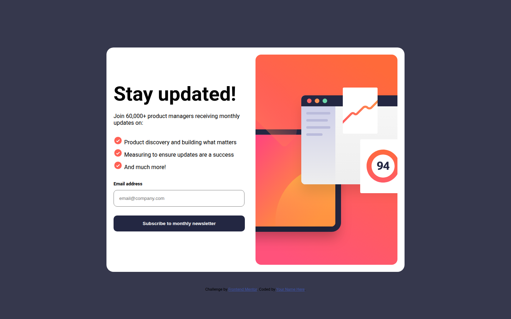
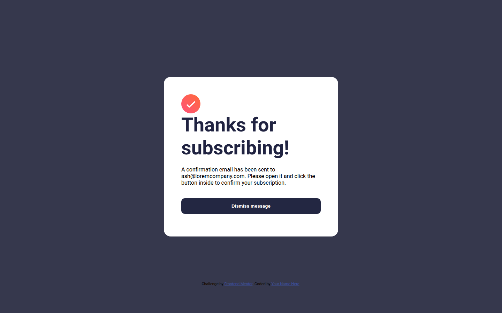
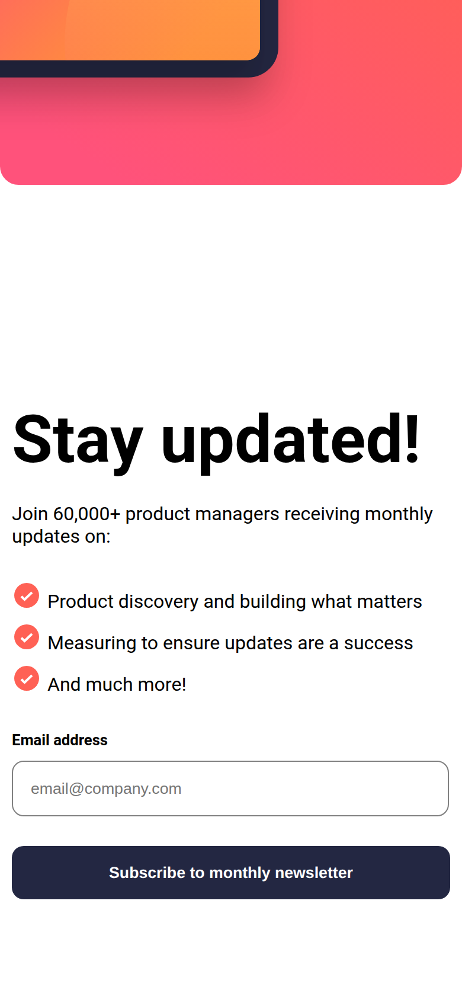

# Newsletter Sign-up Form with Success Message

My solution to the [Newsletter sign-up form with success message](https://www.frontendmentor.io/challenges/newsletter-signup-form-with-success-message-3FC1AZbNrv) challenge on Frontend Mentor. A newsletter sign-up card that switches to a confirmation message after subscribing.



| Success state | Mobile |
| --- | --- |
|  |  |

## Features

- Error message and red border when the email field is empty
- Success message that shows the email address entered
- **Dismiss message** button returns to the form
- Stacked layout on mobile, side by side on desktop

## Built with

- Semantic HTML
- CSS with Flexbox and media queries
- Vanilla JavaScript for form state

## Run locally

No build step or dependencies. Open `index.html` in a browser, or serve the folder:

```bash
npx serve .
```
